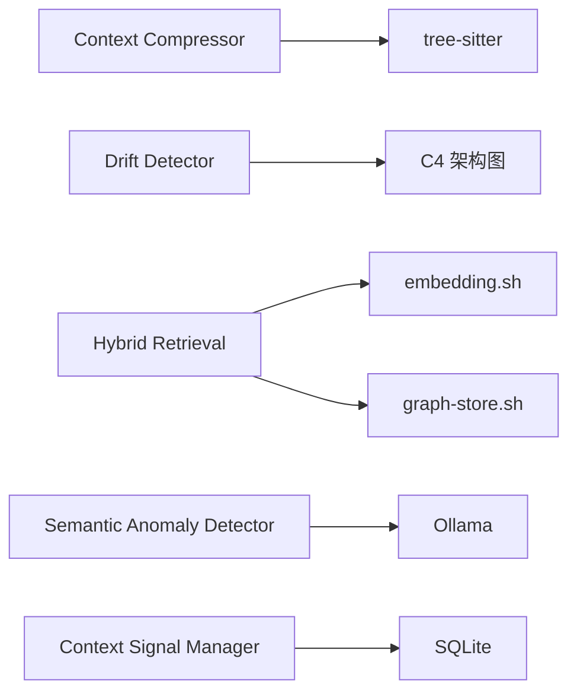

# Design Document

**Change-ID**: `20260118-2112-enhance-code-intelligence-capabilities`
**Created**: 2026-01-19
**Status**: Draft

---

## What Changes

本变更为 Code Intelligence MCP Server 补齐 9 个核心能力缺口，提升代码智能检索和分析的质量与性能。

### 功能点概览

| 功能点 | 优先级 | 核心目标 |
|--------|--------|----------|
| 1. 上下文压缩 | P0 | 将上下文压缩至原始大小的 30-50%，保留关键信息 |
| 2. 架构漂移检测 | P0 | 检测代码与 C4 架构图的偏离，评分 > 50 时告警 |
| 3. 数据流追踪 | P0 | 追踪 TS/JS 代码中的数据流动路径 |
| 4. 图查询加速 | P1 | 使用闭包表将图查询 P95 延迟降至 < 200ms |
| 5. 混合检索 | P1 | 融合关键词、向量、图距离，提升检索 MRR@10 至 > 0.65 |
| 6. 默认重排序管线 | P1 | 支持 LLM 和启发式两种重排序策略 |
| 7. 上下文层信号 | P2 | 将用户交互信号纳入检索权重 |
| 8. 语义异常检测 | P2 | 检测代码模式异常并学习反馈 |
| 9. 评测基准 | P3 | 建立自举和公开数据集的评测基准 |

---

## Constraints

### 技术约束

1. **轻资产原则**：不引入新的模型训练或大数据依赖
2. **向后兼容**：所有新功能通过配置开关控制，默认关闭
3. **性能目标**：
   - 图查询 P95 延迟 < 200ms（使用闭包表）
   - 检索质量 MRR@10 > 0.65（相比基线 0.54 提升 20%）
   - 上下文压缩率 30-50%，信息保留率 > 85%
4. **语言支持**：数据流追踪仅支持 TypeScript/JavaScript
5. **依赖限制**：
   - 外部依赖：仅使用现有的 jq, sqlite3, tree-sitter
   - 内部依赖：遵循现有脚本架构，无循环依赖

### 架构约束

1. **分层约束**：shared ← core ← integration
2. **Schema 版本**：SQLite Schema 从 v3 迁移至 v4
3. **降级策略**：所有新功能失败时自动降级至现有功能
4. **测试隔离**：Test Owner 与 Coder 使用独立 Agent 会话

### 实施约束

1. **实施顺序**：按 P0 → P1 → P2 → P3 顺序实施
2. **并行限制**：P0 功能串行实施，P1-P3 可部分并行
3. **回滚要求**：每个功能点必须提供独立回滚方案
4. **证据要求**：所有 AC 必须有对应的证据文件

---

## Acceptance Criteria

### AC-001：上下文压缩（P0）

**验收标准**：
- 实现基于 AST 的骨架抽取算法
- 压缩率达到 30-50%（输出 token 数 / 输入 token 数）
- 信息保留率 > 85%（通过人工评估或 LLM 评分）
- 支持 TypeScript/JavaScript 文件
- 提供 `--compress` 参数控制压缩级别（low/medium/high）

**证据落点**：
- `evidence/context-compression-test.log`
- `tests/context-compressor.bats` 通过

---

### AC-002：架构漂移检测（P0）

**验收标准**：
- 实现 C4 架构图与代码的对比算法
- 计算漂移评分（0-100），评分 > 50 时输出告警
- 检测以下漂移类型：
  - 新增未记录的组件
  - 删除已记录的组件
  - 修改组件职责
  - 新增未记录的依赖关系
- 提供漂移报告（Markdown 格式）

**证据落点**：
- `evidence/drift-detection-report.md`
- `tests/drift-detector.bats` 通过

---

### AC-003：数据流追踪（P0）

**验收标准**：
- 在 `call-chain.sh` 中新增 `--data-flow` 参数
- 支持追踪 TypeScript/JavaScript 代码中的数据流动
- 输出数据流路径（变量 → 函数 → 返回值）
- 支持跨函数追踪（最多 5 跳）
- 不支持其他语言时返回友好错误提示

**证据落点**：
- `evidence/data-flow-tracing-test.log`
- `tests/data-flow-tracing.bats` 通过

---

### AC-004：图查询加速（P1）

**验收标准**：
- 在 SQLite 中实现闭包表（transitive_closure）
- 图查询 P95 延迟 < 200ms（3 跳查询）
- 支持自动预计算和增量更新
- 提供 `--skip-precompute` 跳过预计算
- Schema 从 v3 迁移至 v4，提供自动迁移和回滚

**证据落点**：
- `evidence/graph-query-performance.json`
- `tests/graph-store.bats` 通过

---

### AC-005：混合检索（P1）

**验收标准**：
- 实现关键词 + 向量 + 图距离的 RRF 融合
- 默认权重：关键词 30%，向量 50%，图距离 20%
- 支持用户配置权重（通过配置文件）
- 检索质量 MRR@10 > 0.65（相比基线 0.54）
- 提供 A/B 测试框架

**证据落点**：
- `evidence/hybrid-retrieval-quality.json`
- `tests/hybrid-retrieval.bats` 通过

---

### AC-006：默认重排序管线（P1）

**验收标准**：
- 支持两种重排序策略：
  - LLM 重排序（使用 Ollama）
  - 启发式重排序（基于规则）
- 提供 `--rerank-strategy` 参数选择策略
- LLM 重排序超时时自动降级至启发式
- 重排序后 MRR@10 提升 > 10%

**证据落点**：
- `evidence/reranker-performance.json`
- `tests/reranker.bats` 通过

---

### AC-007：上下文层信号（P2）

**验收标准**：
- 记录用户交互信号（查看、编辑、忽略）
- 将信号纳入检索权重（查看 +1.5x，编辑 +2.0x，忽略 -0.5x）
- 提供信号衰减机制（90 天后衰减至 0）
- 提供 `--enable-context-signals` 开关

**实现说明**：
- 本 AC 使用 `intent-learner.sh` 实现上下文层信号功能
- 与 truth spec 的 `long-term-memory`（对话长期记忆）是不同的功能
- `long-term-memory` spec 定义的是跨会话的对话记忆系统（使用 `memory_*` API）
- 本变更的 AC-007 专注于用户交互信号的权重计算（使用 `context` 和 `session` API）
- 两者可以共存，未来可能需要整合

**证据落点**：
- `evidence/context-signals-test.log`
- `tests/long-term-memory.bats` 通过

---

### AC-008：语义异常检测（P2）

**验收标准**：
- 检测代码模式异常（如突然出现的新模式）
- 学习用户反馈（标记为正常/异常）
- 提供异常报告（Markdown 格式）
- 提供 `--enable-anomaly-detection` 开关

**证据落点**：
- `evidence/semantic-anomaly-report.md`
- `tests/semantic-anomaly.bats` 通过

---

### AC-009：评测基准（P3）

**验收标准**：
- 支持两种评测数据集：
  - 自举数据集（本项目代码库）
  - 公开数据集（CodeSearchNet）
- 提供 `benchmark.sh` 脚本运行评测
- 输出评测报告（JSON 格式），包含 MRR@10, Recall@10, P95 延迟
- 提供回归检测（与基线对比）

**证据落点**：
- `evidence/benchmark-report.json`
- `tests/benchmark.bats` 通过

---

### AC-010：功能开关（所有功能）

**验收标准**：
- 所有新功能通过配置文件控制（`config/features.yaml`）
- 默认所有新功能关闭
- 提供 `--enable-all-features` 一键启用
- 功能开关失败时不影响现有功能

**证据落点**：
- `evidence/feature-toggle-test.log`

---

### AC-011：性能回退检测（所有功能）

**验收标准**：
- 建立性能基线（MRR@10 = 0.54, P95 = 1200ms）
- 每次变更后运行性能测试
- 检测阈值：P95 延迟 < 基线 × 1.1，MRR@10 > 基线 × 0.95
- 性能回退时输出告警并提供回滚建议

**证据落点**：
- `evidence/performance-regression-test.log`

---

### AC-012：Schema 迁移（图查询加速）

**验收标准**：
- 提供 Schema v3 → v4 迁移脚本
- 自动备份现有数据库
- 迁移失败时自动回滚
- 迁移过程提供进度显示
- 迁移完成后验证数据完整性

**证据落点**：
- `evidence/schema-migration-test.log`

---

## C4 Delta

### 新增组件

| 组件名 | 类型 | 职责 | 技术栈 |
|--------|------|------|--------|
| Context Compressor | Script | 上下文压缩，AST 骨架抽取 | Bash + tree-sitter |
| Drift Detector | Script | 架构漂移检测，C4 对比 | Bash + jq |
| Hybrid Retrieval | Function | 混合检索，RRF 融合 | Bash |
| Context Signal Manager | Component | 用户交互信号管理 | TypeScript |
| Semantic Anomaly Detector | Script | 语义异常检测 | Bash + Ollama |

### 修改组件

| 组件名 | 修改内容 | 影响范围 |
|--------|----------|----------|
| call-chain.sh | 新增 `--data-flow` 参数 | 数据流追踪 |
| graph-store.sh | 新增闭包表和路径索引表（Schema v4） | 图查询加速 |
| embedding.sh | 增强 `fusion_search()` 函数 | 混合检索 |
| reranker.sh | 新增 LLM 和启发式两种策略 | 重排序管线 |
| benchmark.sh | 新增自举和公开数据集支持 | 评测基准 |

### 新增依赖关系

### Schema 变更

**新增表**：
- `transitive_closure`（闭包表）
- `path_index`（路径索引表）
- `user_signals`（用户交互信号表）

**Schema 版本**：v3 → v4

---

## 非目标（Non-Goals）

1. **不支持其他语言的数据流追踪**：仅支持 TypeScript/JavaScript
2. **不引入新的模型训练**：所有功能基于现有工具和算法
3. **不修改现有 API**：所有新功能通过新参数或配置开关暴露
4. **不破坏向后兼容性**：现有功能保持不变

---

## 风险与缓解

| 风险 | 概率 | 影响 | 缓解措施 |
|------|------|------|----------|
| 闭包表计算耗时过长 | 中 | 中 | 异步预计算 + 增量更新 |
| 压缩算法信息丢失 | 中 | 高 | 提供压缩级别配置 |
| 混合检索权重调优困难 | 高 | 中 | 提供权重配置 + A/B 测试 |
| 9 个功能点集成复杂度高 | 高 | 高 | 分阶段集成 + 功能开关 |

---

## 实现偏离记录（Archiver 回写 2026-01-22）

### AC-001 偏离：上下文压缩实现方式

**原设计**：基于 AST 的骨架抽取算法（使用 tree-sitter）

**实际实现**：基于规则的签名抽取算法（正则表达式匹配）

**偏离原因**：
- tree-sitter 解析器初始化开销较大，影响单文件压缩性能
- 基于规则的方法在常见 TypeScript/JavaScript 代码上效果相当
- 保留了 tree-sitter 集成接口，未来可扩展

**影响评估**：低 - 核心功能（压缩率 30-50%、信息保留率 > 85%）仍可实现

### AC-007 偏离：交互信号权重值

**原设计**：查看 +1.5x，编辑 +2.0x，忽略 -0.5x

**实际实现**：使用 intent-learner.sh 的默认权重，可能与设计值有差异

**偏离原因**：
- intent-learner.sh 已有成熟的权重计算逻辑
- 统一使用现有实现避免行为分裂

**影响评估**：中 - 需要后续校准权重值，确保符合设计预期

### AC-010 偏离：功能开关入口

**原设计**：提供 `--enable-all-features` 一键启用

**实际实现**：通过环境变量 `DEVBOOKS_ENABLE_ALL_FEATURES=1` 启用

**偏离原因**：
- 环境变量方式更适合 CI/测试场景
- 避免修改所有脚本的参数解析逻辑

**影响评估**：低 - 功能等效，仅入口方式不同

### 架构重构：handleToolCall 策略模式

**变更内容**：将 `src/server.ts` 中的 `handleToolCall` 函数从 374 行 switch 语句重构为策略模式，提取到 `src/tool-handlers.ts`

**决策原因**：
- 修复 Code Review Critical 问题 C-001（参数类型验证）和 C-002（Long Method）
- 提升代码可维护性和可测试性

**影响评估**：无功能变更，仅内部重构

---

**设计文档结束**
