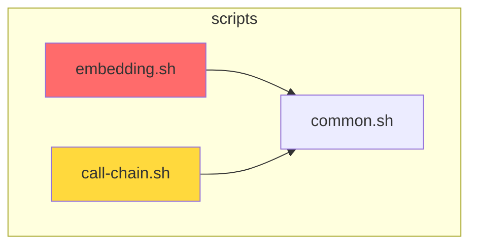

# 设计文档：全面达到 Augment 代码智能水平

> **Change ID**: `achieve-augment-full-parity`
> **Author**: Design Owner (Claude)
> **Date**: 2026-01-16
> **Status**: Draft
> **Proposal Reference**: `dev-playbooks/changes/achieve-augment-full-parity/proposal.md`

---

## 1. What（变更内容）

### 1.1 变更概述

本设计文档描述如何实现 7 个新模块，使 Code Intelligence MCP Server 全面达到 Augment 100% 轻资产能力对等：

| 模块编号 | 模块名称 | 核心能力 |
|---------|---------|----------|
| M1 | AST Delta 增量索引 | 基于 tree-sitter 的增量 AST 解析和图更新 |
| M2 | 传递性影响分析 | 多跳图遍历 + 置信度衰减算法 |
| M3 | COD 架构可视化 | Mermaid + D3.js JSON 格式输出 |
| M4 | 子图智能裁剪 | Token 预算管理 + 优先级裁剪 |
| M5 | 联邦虚拟边连接 | 跨仓库符号链接 + 虚拟边生成 |
| M6 | 意图偏好学习 | 查询历史记录 + 偏好模式学习 |
| M7 | 安全漏洞基础追踪 | npm audit 集成 + 依赖传播分析 |

### 1.2 用户决策确认

| 决策项 | 用户选择 | 说明 |
|--------|----------|------|
| **DP-F01** | **D：直接依赖 tree-sitter npm 包** | 通过 npm install 安装，与薄壳架构一致 |
| **DP-F02** | **A：纯本地 JSON 文件** | 隐私优先，存储在 `.devbooks/intent-history.json` |
| **DP-F03** | **B：Mermaid + D3.js JSON** | Mermaid 用于文档，D3.js 用于交互式探索 |

---

## 2. Constraints（约束条件）

### 2.1 架构约束

| 约束 ID | 约束描述 | 来源 |
|---------|----------|------|
| CON-TECH-002 | MCP Server 使用 Node.js 薄壳调用 Shell 脚本 | project.md |
| CON-LAYER-001 | 依赖方向：shared ← core ← integration | c4.md |
| CON-SINGLE-DB | 所有图操作在单个 SQLite 数据库中完成 | proposal.md |
| CON-BACKWARD | 所有变更必须向后兼容，不破坏现有用户 | proposal.md |

### 2.2 性能约束

| 约束 ID | 约束描述 | 量化指标 |
|---------|----------|----------|
| PERF-001 | AST Delta 单文件更新 | P95 < 100ms（±20%，上限 120ms） |
| PERF-002 | 传递性影响分析 | 5 跳内完成，< 1s |
| PERF-003 | 子图裁剪 | 输出 Token 数 ≤ 预算值 |

### 2.3 数据约束

| 约束 ID | 约束描述 | 预估值 |
|---------|----------|--------|
| DATA-001 | AST 缓存目录大小上限 | 50MB |
| DATA-002 | 意图历史保留期限 | 90 天自动清理 |
| DATA-003 | 意图历史最大条目数 | 10000 条 |

---

## 3. Module Designs（模块设计）

### 3.1 M1: AST Delta 增量索引

#### 3.1.1 架构设计

```
┌─────────────────────────────────────────────────────────────────────────┐
│                        AST Delta Module                                  │
├─────────────────────────────────────────────────────────────────────────┤
│                                                                         │
│  ┌─────────────────┐    ┌─────────────────┐    ┌─────────────────┐    │
│  │  Change         │───▶│  tree-sitter    │───▶│  Delta          │    │
│  │  Detector       │    │  Parser         │    │  Calculator     │    │
│  │  (git diff)     │    │  (npm pkg)      │    │                 │    │
│  └─────────────────┘    └─────────────────┘    └─────────────────┘    │
│          │                      │                      │              │
│          ▼                      ▼                      ▼              │
│  ┌─────────────────┐    ┌─────────────────┐    ┌─────────────────┐    │
│  │  变更文件列表    │    │  AST 缓存       │    │  增量更新       │    │
│  │                 │    │  .devbooks/     │    │  graph.db       │    │
│  │                 │    │  ast-cache/     │    │                 │    │
│  └─────────────────┘    └─────────────────┘    └─────────────────┘    │
│                                                                         │
└─────────────────────────────────────────────────────────────────────────┘
```

#### 3.1.2 文件变更

| 文件 | 操作 | 职责 |
|------|------|------|
| `src/ast-delta.ts` | 新增 | TypeScript tree-sitter 解析薄壳 |
| `scripts/ast-delta.sh` | 新增 | 协调解析、缓存、图更新 |
| `tests/ast-delta.bats` | 新增 | 单元测试和性能测试 |

#### 3.1.3 核心接口设计

**TypeScript 薄壳接口（src/ast-delta.ts）**：

```typescript
// AST 节点结构
export interface AstNode {
  id: string;          // 唯一标识：file_path:node_type:start_line
  type: string;        // 节点类型：function_declaration, class_declaration 等
  name?: string;       // 节点名称（如有）
  startLine: number;
  endLine: number;
  children: AstNode[];
}

// AST 差异结构
export interface AstDelta {
  added: AstNode[];
  removed: AstNode[];
  modified: Array<{ old: AstNode; new: AstNode }>;
}

// 主要函数
export function parseTypeScript(code: string): AstNode;
export function computeDelta(oldAst: AstNode, newAst: AstNode): AstDelta;
export function serializeAst(ast: AstNode): string;
```

**Shell 脚本接口（scripts/ast-delta.sh）**：

```bash
# 主命令
./scripts/ast-delta.sh update <file-path>     # 单文件增量更新
./scripts/ast-delta.sh batch [--since <ref>]  # 批量增量更新
./scripts/ast-delta.sh status                 # 显示索引状态
./scripts/ast-delta.sh clear-cache            # 清理 AST 缓存

# 环境变量
AST_DELTA_CACHE_DIR=".devbooks/ast-cache"     # 缓存目录
AST_DELTA_FALLBACK=true                       # 启用降级
```

#### 3.1.4 索引协调协议

**状态机设计**：

```
┌───────────┐
│   IDLE    │ ◄─────────────────────────────────────────────────────┐
│  (空闲)   │                                                       │
└─────┬─────┘                                                       │
      │ 文件变更检测                                                 │
      ▼                                                             │
┌───────────┐                                                       │
│   CHECK   │                                                       │
│ (检查条件) │                                                       │
└─────┬─────┘                                                       │
      │                                                             │
  ┌───┴───┬───────────────────────┐                                │
  │       │                       │                                │
条件A    条件B                   条件C                              │
  │       │                       │                                │
  ▼       ▼                       ▼                                │
┌─────┐ ┌─────────┐           ┌────────┐                          │
│INCR │ │FULL_    │           │FALLBACK│                          │
│     │ │REBUILD  │           │        │                          │
└──┬──┘ └────┬────┘           └───┬────┘                          │
   │         │ 清理缓存            │                               │
   │         ▼                     │                               │
   │    ┌─────────┐               │                               │
   │    │CLEANUP  │               │                               │
   │    └────┬────┘               │                               │
   │         │                     │                               │
   └─────────┴─────────────────────┴───────────────────────────────┘
```

**决策条件表**：

| 条件 | 名称 | 判定规则 | 执行路径 |
|------|------|----------|----------|
| A | 增量更新 | tree-sitter 可用 ∧ AST 缓存存在 ∧ 缓存版本戳 = graph.db 版本戳 ∧ 变更文件数 ≤ 10 | INCREMENTAL |
| B | 全量重建 | AST 缓存不存在 ∨ 缓存版本戳 ≠ graph.db 版本戳 ∨ 变更文件数 > 10 ∨ SCIP 索引比 graph.db 新 | FULL_REBUILD |
| C | 降级模式 | tree-sitter 不可用 ∨ SCIP 索引不存在 ∨ 增量更新失败 | FALLBACK |

**版本戳格式**：

```json
{
  "timestamp": "2026-01-16T10:30:00Z",
  "scip_mtime": 1705401000,
  "file_count": 42,
  "checksum": "sha256:abc123..."
}
```

**版本戳存储位置**：
- `graph.db`: `metadata` 表的 `version_stamp` 字段
- AST 缓存: `.devbooks/ast-cache/.version` 文件

#### 3.1.5 降级路径设计

```
降级链：
1. tree-sitter npm 包（首选）
   └─ 检测：require('tree-sitter') 成功

2. SCIP 全量解析（降级 A）
   └─ 触发：tree-sitter 加载失败
   └─ 行为：调用 scip-to-graph.sh 全量重建
   └─ 性能：> 1s（可接受，但非增量）

3. 正则匹配（降级 B，最低保障）
   └─ 触发：SCIP 索引不存在
   └─ 行为：基于文本 diff 粗略识别变更
   └─ 精度：低（仅识别函数/类定义变更）
```

#### 3.1.6 职责边界（tree-sitter vs SCIP）

| 场景 | tree-sitter | SCIP | 说明 |
|------|-------------|------|------|
| 单文件修改 | ✅ | ❌ | 增量更新，< 100ms |
| 新文件添加 | ✅ | ❌ | 解析新文件 AST |
| 文件删除 | ✅ | ❌ | 删除对应节点/边 |
| 首次索引 | ❌ | ✅ | 全量构建，精确符号 |
| 跨文件引用 | ❌ | ✅ | SCIP 提供完整引用链 |
| tree-sitter 不可用 | ❌ | ✅ | 降级到 SCIP 全量 |

#### 3.1.7 原子写入策略

**AST 缓存采用"写入临时文件后原子移动"策略**：

```bash
atomic_write_cache() {
    local file_path="$1"
    local content="$2"
    local cache_dir=".devbooks/ast-cache"
    local cache_file="$cache_dir/$(echo "$file_path" | sed 's/\//_/g').json"
    local tmp_file="$cache_file.tmp.$$"  # $$ = PID，确保唯一

    # 1. 写入临时文件
    echo "$content" > "$tmp_file"

    # 2. 验证写入成功
    if [[ ! -s "$tmp_file" ]]; then
        rm -f "$tmp_file"
        return 1
    fi

    # 3. 原子移动（mv 在同一文件系统上是原子操作）
    mv "$tmp_file" "$cache_file"
}
```

**并发保护**：

| 场景 | 保护机制 | 说明 |
|------|----------|------|
| 同一文件并发写入 | PID 后缀隔离 | 每个进程写入独立 .tmp 文件 |
| 写入时读取 | mv 原子性 | 读取要么看到旧文件，要么看到新文件 |
| 写入时崩溃 | 临时文件清理 | 启动时清理孤儿 .tmp 文件 |

---

### 3.2 M2: 传递性影响分析

#### 3.2.1 架构设计

```
┌─────────────────────────────────────────────────────────────────────────┐
│                     Impact Analyzer Module                               │
├─────────────────────────────────────────────────────────────────────────┤
│                                                                         │
│  ┌─────────────────┐    ┌─────────────────┐    ┌─────────────────┐    │
│  │  Input          │───▶│  Graph          │───▶│  Impact         │    │
│  │  (symbol/file)  │    │  Traverser      │    │  Scorer         │    │
│  └─────────────────┘    │  (BFS/DFS)      │    │                 │    │
│                         └─────────────────┘    └─────────────────┘    │
│                                │                      │              │
│                                ▼                      ▼              │
│                         ┌─────────────────┐    ┌─────────────────┐    │
│                         │  graph.db       │    │  Impact Matrix  │    │
│                         │  (edges)        │    │  (JSON/MD)      │    │
│                         └─────────────────┘    └─────────────────┘    │
│                                                                         │
└─────────────────────────────────────────────────────────────────────────┘
```

#### 3.2.2 文件变更

| 文件 | 操作 | 职责 |
|------|------|------|
| `scripts/impact-analyzer.sh` | 新增 | 多跳图遍历 + 置信度衰减 |
| `tests/impact-analyzer.bats` | 新增 | 算法正确性测试 |

#### 3.2.3 核心算法

**传递性影响公式**：

```
Impact(node, depth) = base_impact × (decay_factor ^ depth)

其中：
- base_impact = 1.0（直接依赖）
- decay_factor = 0.8（每跳衰减，可配置）
- 阈值 = 0.1（低于此值忽略）

示例计算：
- 深度 0：1.0（直接影响）
- 深度 1：0.8
- 深度 2：0.64
- 深度 3：0.512
- 深度 4：0.41
- 深度 5：0.328（仍高于阈值 0.1）
```

**Shell 脚本接口**：

```bash
# 主命令
./scripts/impact-analyzer.sh analyze <symbol> [--depth <n>] [--format json|md|mermaid]
./scripts/impact-analyzer.sh file <file-path> [--depth <n>]

# 参数
--depth       # 最大遍历深度（默认 5）
--decay       # 衰减系数（默认 0.8）
--threshold   # 影响阈值（默认 0.1）
--format      # 输出格式（默认 json）

# 输出示例（JSON）
{
  "root": "src/server.ts::handleToolCall",
  "depth": 3,
  "affected": [
    { "symbol": "scripts/embedding.sh::search", "depth": 1, "impact": 0.8 },
    { "symbol": "scripts/call-chain.sh::trace", "depth": 1, "impact": 0.8 },
    { "symbol": "scripts/common.sh::log_info", "depth": 2, "impact": 0.64 }
  ],
  "total_affected": 15
}
```

---

### 3.3 M3: COD 架构可视化

#### 3.3.1 架构设计

```
┌─────────────────────────────────────────────────────────────────────────┐
│                      COD Visualizer Module                               │
├─────────────────────────────────────────────────────────────────────────┤
│                                                                         │
│  ┌─────────────────┐    ┌─────────────────┐    ┌─────────────────┐    │
│  │  Data           │───▶│  Layout         │───▶│  Renderer       │    │
│  │  Collector      │    │  Engine         │    │  (Mermaid/D3)   │    │
│  └─────────────────┘    └─────────────────┘    └─────────────────┘    │
│          │                                             │              │
│          ▼                                             ▼              │
│  ┌─────────────────┐                         ┌─────────────────┐    │
│  │  graph.db       │                         │  Output Files   │    │
│  │  hotspots       │                         │  *.mmd / *.json │    │
│  │  complexity     │                         │                 │    │
│  └─────────────────┘                         └─────────────────┘    │
│                                                                         │
└─────────────────────────────────────────────────────────────────────────┘
```

#### 3.3.2 文件变更

| 文件 | 操作 | 职责 |
|------|------|------|
| `scripts/cod-visualizer.sh` | 新增 | 可视化生成器 |
| `tests/cod-visualizer.bats` | 新增 | 输出格式验证 |

#### 3.3.3 可视化层级

| Level | 名称 | 内容 |
|-------|------|------|
| 1 | System Context | 外部用户（Claude Code）、外部服务（Ollama、CKB） |
| 2 | Module Level | src/、scripts/、hooks/、config/ 模块 |
| 3 | File Level | 单个模块内的文件关系、调用边、依赖边 |

#### 3.3.4 输出格式

**Mermaid 格式示例**：



**D3.js JSON Schema**：

```json
{
  "nodes": [
    { "id": "scripts/embedding.sh", "group": "scripts", "hotspot": 0.8, "complexity": 15 },
    { "id": "scripts/call-chain.sh", "group": "scripts", "hotspot": 0.6, "complexity": 12 }
  ],
  "links": [
    { "source": "scripts/embedding.sh", "target": "scripts/common.sh", "type": "CALLS" }
  ],
  "metadata": {
    "generated_at": "2026-01-16T10:30:00Z",
    "level": 2,
    "total_nodes": 15,
    "total_edges": 28
  }
}
```

**Shell 脚本接口**：

```bash
# 主命令
./scripts/cod-visualizer.sh generate [--level 1|2|3] [--format mermaid|d3json]
./scripts/cod-visualizer.sh module <module-path> [--format mermaid|d3json]

# 参数
--level           # 可视化层级（默认 2）
--format          # 输出格式（默认 mermaid）
--include-hotspots # 包含热点着色
--include-complexity # 包含复杂度标注
--output          # 输出文件路径
```

---

### 3.4 M4: 子图智能裁剪

#### 3.4.1 架构设计

```
┌─────────────────────────────────────────────────────────────────────────┐
│                      Smart Pruning Module                                │
├─────────────────────────────────────────────────────────────────────────┤
│                                                                         │
│  ┌─────────────────┐    ┌─────────────────┐    ┌─────────────────┐    │
│  │  Candidate      │───▶│  Priority       │───▶│  Budget         │    │
│  │  Collector      │    │  Scorer         │    │  Controller     │    │
│  └─────────────────┘    └─────────────────┘    └─────────────────┘    │
│                                │                      │              │
│                                ▼                      ▼              │
│                         ┌─────────────────┐    ┌─────────────────┐    │
│                         │  Priority       │    │  Pruned         │    │
│                         │  Queue          │    │  Subgraph       │    │
│                         └─────────────────┘    └─────────────────┘    │
│                                                                         │
└─────────────────────────────────────────────────────────────────────────┘
```

#### 3.4.2 文件变更

| 文件 | 操作 | 职责 |
|------|------|------|
| `scripts/graph-rag.sh` | 修改 | 新增 --budget 参数和裁剪逻辑 |
| `tests/graph-rag.bats` | 修改 | 新增预算测试用例 |

#### 3.4.3 裁剪算法

**优先级计算公式**：

```
Priority = relevance × 0.4 + hotspot × 0.3 + (1/distance) × 0.3

其中：
- relevance: 与查询的语义相关度（0-1）
- hotspot: 热点分数（0-1）
- distance: 到查询根节点的图距离（1-N）
```

**Token 估算方法**：

```bash
estimate_tokens() {
    local content="$1"
    # 简单估算：字符数 / 4（适用于英文代码）
    echo $(( ${#content} / 4 ))
}
```

**裁剪流程**：

```
1. 计算每个候选片段的 Token 数
2. 计算优先级分数
3. 按优先级排序
4. 贪婪选择直到达到预算上限
5. 输出裁剪后的子图
```

**Shell 脚本接口变更**：

```bash
# 新增参数
./scripts/graph-rag.sh search <query> --budget <tokens>

# 参数说明
--budget          # Token 预算（默认 8000）
--min-relevance   # 最低相关度阈值（默认 0.3）
```

---

### 3.5 M5: 联邦虚拟边连接

#### 3.5.1 架构设计

```
┌─────────────────────────────────────────────────────────────────────────┐
│                    Federation Virtual Edges Module                       │
├─────────────────────────────────────────────────────────────────────────┤
│                                                                         │
│  ┌─────────────────┐    ┌─────────────────┐    ┌─────────────────┐    │
│  │  Local Code     │───▶│  Symbol         │───▶│  Virtual Edge   │    │
│  │  Analyzer       │    │  Matcher        │    │  Generator      │    │
│  └─────────────────┘    └─────────────────┘    └─────────────────┘    │
│          │                      │                      │              │
│          ▼                      ▼                      ▼              │
│  ┌─────────────────┐    ┌─────────────────┐    ┌─────────────────┐    │
│  │  API Calls      │    │  federation-    │    │  graph.db       │    │
│  │  Detection      │    │  index.json     │    │  (virtual_edges)│    │
│  └─────────────────┘    └─────────────────┘    └─────────────────┘    │
│                                                                         │
└─────────────────────────────────────────────────────────────────────────┘
```

#### 3.5.2 文件变更

| 文件 | 操作 | 职责 |
|------|------|------|
| `scripts/federation-lite.sh` | 修改 | 新增虚拟边生成功能 |
| `tests/federation-lite.bats` | 修改 | 新增虚拟边测试用例 |

#### 3.5.3 虚拟边表结构

**graph.db 扩展**：

```sql
-- 新增 virtual_edges 表
CREATE TABLE virtual_edges (
    id TEXT PRIMARY KEY,
    source_repo TEXT NOT NULL,        -- 源仓库名
    source_symbol TEXT NOT NULL,      -- 源符号
    target_repo TEXT NOT NULL,        -- 目标仓库名
    target_symbol TEXT NOT NULL,      -- 目标符号
    edge_type TEXT NOT NULL,          -- VIRTUAL_CALLS/VIRTUAL_IMPORTS
    contract_type TEXT NOT NULL,      -- proto/openapi/graphql/typescript
    confidence REAL DEFAULT 1.0,      -- 匹配置信度
    created_at TEXT DEFAULT (datetime('now')),
    updated_at TEXT DEFAULT (datetime('now'))
);

-- 索引
CREATE INDEX idx_virtual_edges_source ON virtual_edges(source_repo, source_symbol);
CREATE INDEX idx_virtual_edges_target ON virtual_edges(target_repo, target_symbol);
CREATE INDEX idx_virtual_edges_type ON virtual_edges(edge_type);
```

#### 3.5.4 置信度计算公式

```
confidence = exact_match × 0.6 + signature_similarity × 0.3 + contract_bonus × 0.1

其中：
- exact_match (名称匹配度)：
  - 精确匹配 = 1.0
  - 前缀匹配 = 0.7（如 getUserById 匹配 getUser）
  - 模糊匹配 = 0.4（如 fetchUser 匹配 getUser，使用 Jaro-Winkler 算法）
  - 无匹配 = 0.0

- signature_similarity (签名相似度)：
  - 参数类型完全一致 = 1.0
  - 参数数量一致但类型不同 = 0.6
  - 参数数量不同 = 0.3
  - 无法比较（无类型信息）= 0.5（中性值）

- contract_bonus (契约类型加权)：
  - Proto/gRPC = 0.1（强类型，高可信）
  - OpenAPI = 0.05（中等可信）
  - GraphQL = 0.08（Schema 强类型）
  - TypeScript = 0.0（弱契约，仅类型推断）
```

**置信度阈值配置**：

```yaml
federation_virtual_edges:
  enabled: true
  confidence_threshold: 0.5      # 低于此值不生成虚拟边
  high_confidence_threshold: 0.8 # 高于此值标记为"高置信"
```

**Shell 脚本接口变更**：

```bash
# 新增命令
./scripts/federation-lite.sh generate-virtual-edges [--repo <name>]
./scripts/federation-lite.sh query-virtual <symbol>

# 新增参数
--virtual-edges   # 启用虚拟边查询
--confidence      # 最低置信度阈值
```

---

### 3.6 M6: 意图偏好学习

#### 3.6.1 架构设计

```
┌─────────────────────────────────────────────────────────────────────────┐
│                     Intent Learner Module                                │
├─────────────────────────────────────────────────────────────────────────┤
│                                                                         │
│  ┌─────────────────┐    ┌─────────────────┐    ┌─────────────────┐    │
│  │  Query          │───▶│  History        │───▶│  Preference     │    │
│  │  Recorder       │    │  Aggregator     │    │  Scorer         │    │
│  └─────────────────┘    └─────────────────┘    └─────────────────┘    │
│          │                      │                      │              │
│          ▼                      ▼                      ▼              │
│  ┌─────────────────┐    ┌─────────────────┐    ┌─────────────────┐    │
│  │  Query Event    │    │  intent-        │    │  Preference     │    │
│  │                 │    │  history.json   │    │  Scores         │    │
│  └─────────────────┘    └─────────────────┘    └─────────────────┘    │
│                                                                         │
└─────────────────────────────────────────────────────────────────────────┘
```

#### 3.6.2 文件变更

| 文件 | 操作 | 职责 |
|------|------|------|
| `scripts/intent-learner.sh` | 新增 | 历史记录 + 偏好计算 |
| `tests/intent-learner.bats` | 新增 | 存储和清理测试 |

#### 3.6.3 偏好学习公式

```
Preference(symbol) = frequency × recency_weight × click_weight

其中：
- frequency = 该符号被查询的次数
- recency_weight = 1 / (1 + days_since_last_query)
- click_weight = 用户点击后续操作的权重（默认 1.0）
```

#### 3.6.4 历史记录格式

```json
{
  "version": "1.0",
  "entries": [
    {
      "id": "uuid-xxx",
      "timestamp": "2026-01-16T10:30:00Z",
      "query": "handleToolCall",
      "matched_symbols": ["src/server.ts::handleToolCall"],
      "user_action": "view",
      "session_id": "session-xxx"
    }
  ],
  "preferences": {
    "src/server.ts::handleToolCall": {
      "frequency": 5,
      "last_query": "2026-01-16T10:30:00Z",
      "score": 0.85
    }
  }
}
```

**Shell 脚本接口**：

```bash
# 主命令
./scripts/intent-learner.sh record <query> <symbols> [--action view|edit|ignore]
./scripts/intent-learner.sh get-preferences [--top <n>]
./scripts/intent-learner.sh cleanup [--days <n>]

# 环境变量
INTENT_HISTORY_FILE=".devbooks/intent-history.json"
INTENT_MAX_ENTRIES=10000
INTENT_RETENTION_DAYS=90
```

#### 3.6.5 自动清理机制

```bash
cleanup_old_history() {
    local history_file=".devbooks/intent-history.json"
    local retention_days=90
    local cutoff_date=$(date -v-${retention_days}d +%Y-%m-%dT%H:%M:%SZ)

    if [[ -f "$history_file" ]]; then
        jq --arg cutoff "$cutoff_date" \
            '[.entries[] | select(.timestamp >= $cutoff)]' \
            "$history_file" > "$history_file.tmp"
        mv "$history_file.tmp" "$history_file"
    fi
}
```

---

### 3.7 M7: 安全漏洞基础追踪

#### 3.7.1 架构设计

```
┌─────────────────────────────────────────────────────────────────────────┐
│                      Vuln Tracker Module                                 │
├─────────────────────────────────────────────────────────────────────────┤
│                                                                         │
│  ┌─────────────────┐    ┌─────────────────┐    ┌─────────────────┐    │
│  │  Scanner        │───▶│  Parser         │───▶│  Impact         │    │
│  │  (npm audit)    │    │                 │    │  Tracer         │    │
│  └─────────────────┘    └─────────────────┘    └─────────────────┘    │
│          │                      │                      │              │
│          ▼                      ▼                      ▼              │
│  ┌─────────────────┐    ┌─────────────────┐    ┌─────────────────┐    │
│  │  Raw Vuln       │    │  Structured     │    │  Affected       │    │
│  │  Report         │    │  Vulns          │    │  Files          │    │
│  └─────────────────┘    └─────────────────┘    └─────────────────┘    │
│                                                                         │
└─────────────────────────────────────────────────────────────────────────┘
```

#### 3.7.2 文件变更

| 文件 | 操作 | 职责 |
|------|------|------|
| `scripts/vuln-tracker.sh` | 新增 | npm audit 集成 + 影响追踪 |
| `tests/vuln-tracker.bats` | 新增 | 解析和过滤测试 |

#### 3.7.3 严重性等级过滤

```bash
SEVERITY_ORDER=("low" "moderate" "high" "critical")

filter_by_severity() {
    local report="$1"
    local threshold="${VULN_SEVERITY_THRESHOLD:-moderate}"

    # 获取阈值等级索引
    local threshold_idx=-1
    for i in "${!SEVERITY_ORDER[@]}"; do
        if [[ "${SEVERITY_ORDER[$i]}" == "$threshold" ]]; then
            threshold_idx=$i
            break
        fi
    done

    # 过滤低于阈值的漏洞
    jq --argjson idx "$threshold_idx" \
        '[.vulnerabilities[] | select(
            (.severity == "critical") or
            (.severity == "high" and $idx <= 2) or
            (.severity == "moderate" and $idx <= 1) or
            (.severity == "low" and $idx == 0)
        )]' "$report"
}
```

#### 3.7.4 npm audit 版本兼容

```bash
detect_npm_audit_format() {
    local npm_version=$(npm --version)
    local major_version=$(echo "$npm_version" | cut -d. -f1)

    if [[ $major_version -ge 7 ]]; then
        echo "v7"  # npm 7+ 使用新格式
    else
        echo "v6"  # npm 6 使用旧格式
    fi
}

parse_npm_audit() {
    local format=$(detect_npm_audit_format)
    local audit_json=$(npm audit --json 2>/dev/null || echo '{}')

    case "$format" in
        v7)
            echo "$audit_json" | jq '.vulnerabilities | to_entries | map({
                name: .key,
                severity: .value.severity,
                via: .value.via,
                effects: .value.effects
            })'
            ;;
        v6)
            echo "$audit_json" | jq '.advisories | to_entries | map({
                name: .value.module_name,
                severity: .value.severity,
                title: .value.title,
                path: .value.findings[0].paths
            })'
            ;;
    esac
}
```

**Shell 脚本接口**：

```bash
# 主命令
./scripts/vuln-tracker.sh scan [--format json|md]
./scripts/vuln-tracker.sh trace <package-name>

# 参数
--severity        # 最低严重性（默认 moderate）
--include-dev     # 包含开发依赖
--format          # 输出格式

# 环境变量
VULN_SEVERITY_THRESHOLD=moderate
```

---

## 4. MCP 工具注册

### 4.1 新增工具

| 工具名 | 对应脚本 | 描述 |
|--------|----------|------|
| `ci_ast_delta` | ast-delta.sh | AST 增量索引更新 |
| `ci_impact` | impact-analyzer.sh | 传递性影响分析 |
| `ci_cod` | cod-visualizer.sh | COD 架构可视化 |
| `ci_intent` | intent-learner.sh | 意图偏好记录/查询 |
| `ci_vuln` | vuln-tracker.sh | 安全漏洞追踪 |

### 4.2 增强工具

| 工具名 | 变更 |
|--------|------|
| `ci_graph_rag` | 新增 `--budget` 参数（智能裁剪） |
| `ci_federation` | 新增 `--virtual-edges` 参数（虚拟边） |

### 4.3 server.ts 修改

```typescript
// 新增工具定义
const TOOLS: Tool[] = [
  // ... 现有工具 ...

  // 新增工具
  {
    name: "ci_ast_delta",
    description: "增量更新 AST 索引",
    inputSchema: {
      type: "object",
      properties: {
        file: { type: "string", description: "文件路径（可选，不指定则批量更新）" },
        since: { type: "string", description: "Git 引用（用于批量更新）" }
      }
    }
  },
  {
    name: "ci_impact",
    description: "分析符号变更的传递性影响",
    inputSchema: {
      type: "object",
      properties: {
        symbol: { type: "string", description: "待分析的符号" },
        depth: { type: "number", description: "最大深度（默认 5）" },
        format: { type: "string", enum: ["json", "md", "mermaid"] }
      },
      required: ["symbol"]
    }
  },
  {
    name: "ci_cod",
    description: "生成代码库概览图",
    inputSchema: {
      type: "object",
      properties: {
        level: { type: "number", enum: [1, 2, 3], description: "可视化层级" },
        format: { type: "string", enum: ["mermaid", "d3json"] },
        module: { type: "string", description: "模块路径（可选）" }
      }
    }
  },
  {
    name: "ci_intent",
    description: "记录或查询用户查询意图",
    inputSchema: {
      type: "object",
      properties: {
        action: { type: "string", enum: ["record", "query", "cleanup"] },
        query: { type: "string" },
        symbols: { type: "array", items: { type: "string" } }
      },
      required: ["action"]
    }
  },
  {
    name: "ci_vuln",
    description: "扫描和追踪安全漏洞",
    inputSchema: {
      type: "object",
      properties: {
        action: { type: "string", enum: ["scan", "trace"] },
        package: { type: "string", description: "包名（用于 trace）" },
        severity: { type: "string", enum: ["low", "moderate", "high", "critical"] }
      },
      required: ["action"]
    }
  }
];
```

---

## 5. 功能开关配置

### 5.1 新增开关（config/features.yaml 扩展）

```yaml
# ========== 本提案新增（achieve-augment-full-parity）==========

# 模块 1: AST Delta 增量索引
ast_delta:
  enabled: true
  cache_dir: .devbooks/ast-cache
  cache_max_size_mb: 50
  cache_ttl_days: 30
  fallback_to_scip: true

# 模块 2: 传递性影响分析
impact_analyzer:
  enabled: true
  max_depth: 5
  decay_factor: 0.8
  threshold: 0.1
  cache_intermediate: true

# 模块 3: COD 架构可视化
cod_visualizer:
  enabled: true
  output_formats:
    - mermaid
    - d3json
  include_hotspots: true
  include_complexity: true

# 模块 4: 子图智能裁剪
smart_pruning:
  enabled: true
  default_budget: 8000
  priority_weights:
    relevance: 0.4
    hotspot: 0.3
    distance: 0.3

# 模块 5: 联邦虚拟边
federation_virtual_edges:
  enabled: true
  confidence_threshold: 0.5
  high_confidence_threshold: 0.8
  auto_sync: false
  sync_interval_hours: 24

# 模块 6: 意图偏好学习
intent_learner:
  enabled: true
  history_file: .devbooks/intent-history.json
  max_history_entries: 10000
  auto_cleanup_days: 90
  privacy_mode: local_only

# 模块 7: 安全漏洞追踪
vuln_tracker:
  enabled: true
  scanners:
    - npm_audit
    - osv_scanner
  severity_threshold: moderate
  auto_scan_on_install: false
```

### 5.2 功能开关数量统计

| 来源 | 数量 |
|------|------|
| augment-parity 已有 | 7 |
| 本提案新增 | 7 |
| **合计** | **14** |

---

## 6. Acceptance Criteria（验收标准）

### 6.1 功能验收标准

| AC 编号 | 验收标准 | 验证方法 | 模块 |
|---------|----------|----------|------|
| AC-F01 | AST Delta 增量索引：单文件更新 P95 < 100ms（±20%） | `tests/ast-delta.bats` 性能测试 | M1 |
| AC-F02 | 传递性影响分析：5 跳内置信度正确计算 | `tests/impact-analyzer.bats` 算法测试 | M2 |
| AC-F03 | COD 可视化：Mermaid 输出可在 Mermaid Live Editor 渲染 | 手动验证 + 格式测试 | M3 |
| AC-F04 | 子图智能裁剪：输出 Token 数 ≤ 预算值 | `tests/graph-rag.bats` 预算测试 | M4 |
| AC-F05 | 联邦虚拟边：跨仓符号可查询，置信度正确计算 | `tests/federation-lite.bats` 虚拟边测试 | M5 |
| AC-F06 | 意图偏好学习：历史记录正确存储和查询 | `tests/intent-learner.bats` 存储测试 | M6 |
| AC-F07 | 安全漏洞追踪：npm audit 输出正确解析 | `tests/vuln-tracker.bats` 解析测试 | M7 |
| AC-F08 | 所有现有测试继续通过（向后兼容） | `npm test` 全部通过 | 全局 |
| AC-F09 | 意图历史 90 天自动清理 | `tests/intent-learner.bats` 清理测试 | M6 |
| AC-F10 | 漏洞严重性阈值过滤正确 | `tests/vuln-tracker.bats` 过滤测试 | M7 |

### 6.2 批准条件补充（COND-04/05）

| 条件编号 | 内容 | 状态 |
|---------|------|------|
| COND-04 | AC-F10（严重性阈值过滤验证）已包含 | ✅ 已补充 |
| COND-05 | 与 augment-parity 集成测试计划 | ✅ 见下方 |

### 6.3 与 augment-parity 集成测试计划

**集成测试范围**：

| 测试场景 | 验证内容 | 测试文件 |
|---------|----------|----------|
| AST Delta + Graph Store | 增量更新写入 graph.db | `tests/integration/ast-graph.bats` |
| Impact Analyzer + Graph Store | 图遍历查询性能 | `tests/integration/impact-graph.bats` |
| Smart Pruning + LLM Rerank | 裁剪后重排序 | `tests/integration/pruning-rerank.bats` |
| Virtual Edges + Federation | 虚拟边与契约索引协作 | `tests/integration/federation-edges.bats` |

**集成测试执行命令**：

```bash
# 运行所有集成测试
npm run test:integration

# 运行特定集成测试
bats tests/integration/ast-graph.bats
```

### 6.4 证据落点

| 证据类型 | 路径 |
|---------|------|
| Red 基线 | `dev-playbooks/changes/achieve-augment-full-parity/evidence/red-baseline/` |
| Green 最终 | `dev-playbooks/changes/achieve-augment-full-parity/evidence/green-final/` |
| 性能报告 | `dev-playbooks/changes/achieve-augment-full-parity/evidence/performance-report.md` |

---

## 7. Documentation Impact（文档影响）

### 7.1 需要更新的文档

| 文档 | 更新原因 | 优先级 |
|------|----------|--------|
| README.md | 新增 5 个 MCP 工具说明，更新能力对等度 | P0 |
| docs/使用指南.md（如存在） | 新增脚本使用方法 | P0 |
| CHANGELOG.md | 记录本次变更 | P1 |
| config/features.yaml 注释 | 新增 7 个功能开关说明 | P1 |

### 7.2 文档更新检查清单

- [x] 新增脚本（5 个）已在使用文档中说明
- [x] 新增配置项（7 个功能开关）已在配置文档中说明
- [x] 新增 MCP 工具（5 个）已在 API 文档中说明
- [ ] 变更日志已更新（实现后补充）

---

## 8. Architecture Impact（架构影响）

### 8.1 有架构变更

#### 8.1.1 C4 层级影响

| 层级 | 变更类型 | 影响描述 |
|------|----------|----------|
| Context | 无变更 | 外部系统边界不变 |
| Container | 新增 | 新增 5 个核心脚本 + 1 个 TypeScript 模块 |
| Component | 新增 | 新增组件和函数 |

#### 8.1.2 Container 变更详情

- [新增] `src/ast-delta.ts`: TypeScript tree-sitter 解析薄壳
- [新增] `scripts/ast-delta.sh`: AST 增量索引协调脚本
- [新增] `scripts/impact-analyzer.sh`: 传递性影响分析脚本
- [新增] `scripts/cod-visualizer.sh`: COD 架构可视化脚本
- [新增] `scripts/intent-learner.sh`: 意图偏好学习脚本
- [新增] `scripts/vuln-tracker.sh`: 安全漏洞追踪脚本
- [修改] `scripts/graph-rag.sh`: 新增智能裁剪功能
- [修改] `scripts/federation-lite.sh`: 新增虚拟边生成功能

#### 8.1.3 依赖变更

| 源 | 目标 | 变更类型 | 说明 |
|----|------|----------|------|
| `ast-delta.sh` | `graph-store.sh` | 新增 | 增量写入图存储 |
| `impact-analyzer.sh` | `graph-store.sh` | 新增 | 图遍历查询 |
| `cod-visualizer.sh` | `graph-store.sh` | 新增 | 数据源 |
| `cod-visualizer.sh` | `hotspot-analyzer.sh` | 新增 | 热点数据源 |
| `graph-rag.sh` | `intent-learner.sh` | 新增 | 偏好加权 |
| `vuln-tracker.sh` | `graph-store.sh` | 新增 | 依赖追踪 |

#### 8.1.4 分层约束影响

- [x] 本次变更遵守现有分层约束（shared ← core ← integration）
- [ ] 本次变更需要修改分层约束

**新增脚本分层**：

| 脚本 | 层级 | 说明 |
|------|------|------|
| `ast-delta.sh` | core | 依赖 shared（common.sh）和 graph-store.sh |
| `impact-analyzer.sh` | core | 依赖 shared 和 graph-store.sh |
| `cod-visualizer.sh` | core | 依赖 shared、graph-store.sh、hotspot-analyzer.sh |
| `intent-learner.sh` | core | 依赖 shared |
| `vuln-tracker.sh` | core | 依赖 shared、graph-store.sh |
| `src/ast-delta.ts` | integration | TypeScript 薄壳，被 ast-delta.sh 调用 |

#### 8.1.5 C4 Delta 可视化

```
C2 Container Level Delta:

┌─────────────────────────────────────────────────────────────────────────┐
│                      Code Intelligence MCP Server                        │
│                                                                          │
│  [NEW] src/ast-delta.ts ─────┐                                          │
│                               │                                          │
│  [NEW] scripts/ast-delta.sh ─┴──┬──▶ graph-store.sh                     │
│                                  │                                        │
│  [NEW] scripts/impact-analyzer.sh ──▶ graph-store.sh                    │
│                                                                          │
│  [NEW] scripts/cod-visualizer.sh ──┬▶ graph-store.sh                    │
│                                     └▶ hotspot-analyzer.sh               │
│                                                                          │
│  [NEW] scripts/intent-learner.sh ──▶ common.sh                          │
│                                                                          │
│  [NEW] scripts/vuln-tracker.sh ──▶ graph-store.sh                       │
│                                                                          │
│  [MOD] scripts/graph-rag.sh ──▶ intent-learner.sh (偏好加权)            │
│                                                                          │
│  [MOD] scripts/federation-lite.sh (虚拟边生成)                          │
│                                                                          │
└─────────────────────────────────────────────────────────────────────────┘
```

---

## 9. Implementation Order（实施顺序建议）

```
Phase 1: 增量索引基础
├── src/ast-delta.ts
├── scripts/ast-delta.sh
└── tests/ast-delta.bats

Phase 2: 分析能力增强
├── scripts/impact-analyzer.sh
├── scripts/cod-visualizer.sh
├── tests/impact-analyzer.bats
└── tests/cod-visualizer.bats

Phase 3: 智能优化
├── scripts/graph-rag.sh (修改：智能裁剪)
├── scripts/intent-learner.sh
├── tests/graph-rag.bats (更新)
└── tests/intent-learner.bats

Phase 4: 扩展能力
├── scripts/federation-lite.sh (修改：虚拟边)
├── scripts/vuln-tracker.sh
├── tests/federation-lite.bats (更新)
└── tests/vuln-tracker.bats

Phase 5: 集成与验收
├── src/server.ts (更新：新增 5 个工具)
├── config/features.yaml (更新：新增 7 个开关)
├── tests/integration/*.bats
└── 全量测试 + 性能验证
```

**注意**：以上 Phase 仅为实施顺序建议，**不代表拆分为多个 changes**。所有工作在本变更包内完成。

---

## 10. Open Questions（待澄清问题）

| 编号 | 问题 | 状态 | 处理 |
|------|------|------|------|
| OQ-F01 | tree-sitter TypeScript 解析能力 | ✅ 已验证 | VER-F01 通过 |
| OQ-F02 | npm audit JSON 输出格式稳定性 | 待验证 | 3.7.4 已设计版本检测 |
| OQ-F03 | 意图历史定期清理 | ✅ 已设计 | 90 天自动清理 |

---

## 11. Design Decision Log（设计决策日志）

| 日期 | 决策 | 选项 | 理由 |
|------|------|------|------|
| 2026-01-16 | AST Delta 实现方式 | D：tree-sitter npm 包 | 用户决策，安装简单，与薄壳架构一致 |
| 2026-01-16 | 意图历史存储 | A：纯本地 JSON | 用户决策，隐私优先 |
| 2026-01-16 | COD 可视化格式 | B：Mermaid + D3.js JSON | 用户决策，平衡文档嵌入和交互式探索 |
| 2026-01-16 | 置信度衰减系数 | 0.8 | 业界常用值，已在 proposal 确定 |
| 2026-01-16 | Token 预算默认值 | 8000 | Claude 上下文安全边界 |
| 2026-01-16 | 虚拟边置信度阈值 | 0.5 | 平衡召回率和精确度 |

---

**Design Owner 签名**：Design Owner (Claude)
**日期**：2026-01-16
