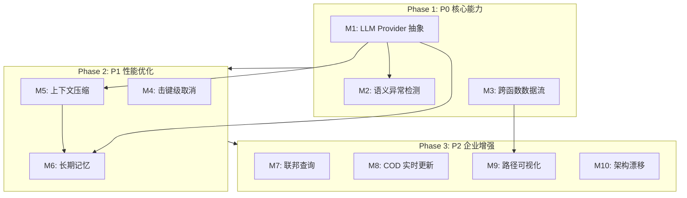

# 实现计划：弥合 Augment 最后 10% 轻资产差距

> **Change ID**: `augment-final-10-percent`
> **Version**: 1.0.0
> **Status**: In Progress
> **Created**: 2026-01-17
> **Last Updated**: 2026-01-17

---

## 主线计划（Main Track）

### Phase 1: P0 功能（核心能力）

#### M1: LLM Provider 抽象接口

**目标**：实现可插拔的 LLM Provider 架构，支持 Anthropic/OpenAI/Ollama/Mock 四种 Provider

**验收锚点**：AC-001, AC-002

- [x] T1.1: 创建 `scripts/llm-provider.sh` 抽象层
  - 定义 `llm_load_provider()` 函数：根据配置加载 Provider
  - 定义 `llm_rerank()` 统一接口：`llm_rerank(query, candidates) → RankedResult`
  - 定义 `llm_call()` 统一接口：`llm_call(prompt) → Response`
  - 定义 `llm_validate_config()` 接口：验证 Provider 配置
  - 定义 `llm_get_info()` 接口：返回 Provider 元信息

- [x] T1.2: 创建 `scripts/llm-providers/` 目录结构
  - 创建目录 `scripts/llm-providers/`
  - 定义 Provider 脚本约定文档

- [x] T1.3: 实现 `scripts/llm-providers/anthropic.sh` Provider
  - 实现 `_anthropic_rerank()` 函数
  - 实现 `_anthropic_call()` 函数
  - 支持 `ANTHROPIC_API_KEY` 环境变量
  - 支持 `claude-3-haiku` 和 `claude-sonnet-4` 模型

- [x] T1.4: 实现 `scripts/llm-providers/openai.sh` Provider
  - 实现 `_openai_rerank()` 函数
  - 实现 `_openai_call()` 函数
  - 支持 `OPENAI_API_KEY` 环境变量
  - 支持 `gpt-4o-mini` 模型

- [x] T1.5: 实现 `scripts/llm-providers/ollama.sh` Provider
  - 实现 `_ollama_rerank()` 函数
  - 实现 `_ollama_call()` 函数
  - 支持本地 Ollama 端点（默认 `http://localhost:11434`）
  - 支持 `llama3` 等本地模型

- [x] T1.6: 实现 `scripts/llm-providers/mock.sh` Provider（测试用）
  - 实现 `_mock_rerank()` 函数：返回固定排序结果
  - 实现 `_mock_call()` 函数：返回固定响应
  - 支持 `LLM_MOCK_FAIL_COUNT` 环境变量模拟失败
  - 支持 `LLM_MOCK_RESPONSE` 环境变量自定义响应

- [x] T1.7: 重构 `scripts/reranker.sh` 使用新接口
  - 移除硬编码的 Anthropic API 调用
  - 改为调用 `llm_provider.sh` 的统一接口
  - 保持现有 CLI 接口不变（COMPAT-001）

- [x] T1.8: 更新 `config/features.yaml` LLM Provider 配置
  - 添加 `llm_provider.enabled` 开关
  - 添加 `llm_provider.default_provider` 配置
  - 添加各 Provider 子配置（env_key, default_model 等）

- [x] T1.9: 创建 `config/llm-providers.yaml` Provider 注册表
  - 定义 Provider 注册格式
  - 注册四种 Provider 及其配置

#### M2: 语义异常检测

**目标**：基于 pattern-learner 扩展，检测违反项目隐式规范的代码

**验收锚点**：AC-003

- [ ] T2.1: 创建 `scripts/semantic-anomaly.sh` 基础结构
  - 实现 CLI 参数解析（--pattern, --output, --threshold）
  - 实现帮助文档
  - source common.sh 保持一致性

- [ ] T2.2: 实现 Pattern Loader 模块
  - 从 `pattern-learner.sh` 加载已学习模式
  - 支持自定义模式文件加载
  - 支持模式优先级配置

- [ ] T2.3: 实现 MISSING_ERROR_HANDLER 检测器
  - 检测缺失的 try-catch 块
  - 检测未处理的 Promise rejection
  - 检测缺失的错误回调

- [ ] T2.4: 实现 INCONSISTENT_API_CALL 检测器
  - 检测同一 API 的不同调用方式
  - 检测参数顺序不一致
  - 检测缺失的必要参数

- [ ] T2.5: 实现 NAMING_VIOLATION 检测器
  - 检测驼峰/下划线命名混用
  - 检测常量命名违规
  - 检测函数命名约定违规

- [ ] T2.6: 实现 MISSING_LOG 检测器
  - 检测关键路径缺失日志
  - 检测错误处理缺失日志
  - 检测入口/出口缺失日志

- [ ] T2.7: 实现 Report Generator 模块
  - 输出 JSON 格式报告
  - 输出人类可读格式报告
  - 提供修复建议

- [ ] T2.8: 集成 pattern-learner.sh
  - 调用 pattern-learner 获取项目模式
  - 基于学习到的模式检测异常
  - 更新异常阈值配置

- [ ] T2.9: 更新 `config/features.yaml` 语义异常配置
  - 添加 `semantic_anomaly.enabled` 开关
  - 添加 `semantic_anomaly.patterns` 列表
  - 添加误报率阈值配置

#### M3: 跨函数数据流追踪

**目标**：扩展 call-chain.sh，支持变量在多函数间的传递追踪

**验收锚点**：AC-004, AC-004a

- [x] T3.1: 扩展 `call-chain.sh` 添加 `--data-flow` 选项
  - 解析新的 CLI 参数
  - 添加方向参数（--direction forward|backward）
  - 添加深度限制参数（--max-depth，默认 5）

- [x] T3.2: 实现污点传播（Taint Propagation）算法
  - 实现 `taint_propagate()` 函数
  - 标记源符号为 TAINTED
  - 沿调用图边传播污点

- [x] T3.3: 实现变量映射追踪
  - 记录每个转换点的变量映射
  - 支持参数传递追踪
  - 支持返回值追踪

- [x] T3.4: 实现循环依赖检测
  - 检测追踪路径中的循环
  - 报告 `CYCLE_DETECTED` 并终止
  - 输出循环路径信息

- [x] T3.5: 实现深度限制和性能优化
  - 强制深度限制（默认 5 跳）
  - 添加缓存机制减少重复计算
  - 单跳延迟 P95 <100ms

- [x] T3.6: 实现数据流输出格式
  - 输出 JSON 格式（source, sink, path）
  - 支持 Mermaid 格式输出
  - 支持文本格式输出

- [x] T3.7: 更新 `config/features.yaml` 数据流追踪配置
  - 添加 `data_flow_tracing.enabled` 开关
  - 添加 `data_flow_tracing.max_depth` 配置

### Phase 2: P1 功能（性能优化）

#### M4: 击键级请求取消

**目标**：将请求取消延迟从 50ms 优化到 <10ms（热启动）

**验收锚点**：AC-005, AC-005a

- [ ] T4.1: 分析现有 daemon.sh 取消机制
  - 记录当前轮询实现
  - 测量基线延迟（预期 ~50ms）
  - 识别瓶颈点

- [ ] T4.2: 实现信号驱动取消机制
  - 添加 SIGUSR1 信号处理器
  - 实现 `setup_cancel_handler()` 函数
  - 实现 `check_cancel_token()` 原子检查

- [ ] T4.3: 实现取消令牌预分配
  - 在请求开始时预分配令牌文件
  - 使用 mktemp 创建唯一令牌
  - 实现令牌清理机制

- [ ] T4.4: 添加 `--cancel-token` 参数
  - 允许外部传入取消令牌
  - 支持跨进程取消
  - 文档化使用方式

- [ ] T4.5: 性能测试和调优
  - 测量热启动 P95 延迟（目标 <10ms）
  - 测量冷启动 P95 延迟（目标 <50ms）
  - 在 10 并发下压力测试

- [ ] T4.6: 更新 `config/features.yaml` 取消配置
  - 添加 `daemon.cancel.signal_mode` 开关
  - 保留 `file` 模式作为降级选项

#### M5: 上下文智能压缩

**目标**：将大型代码库压缩为高信噪比的上下文，压缩率 >=50%

**验收锚点**：AC-006, AC-006a

- [ ] T5.1: 创建 `scripts/context-compressor.sh` 基础结构
  - 实现 CLI 参数解析（--budget, --output, --format）
  - 实现帮助文档
  - source common.sh

- [ ] T5.2: 实现 AST 骨架提取（Stage 1）
  - 保留：函数签名、类定义、接口
  - 移除：函数体、注释、空白
  - 目标压缩率：~60%

- [ ] T5.3: 实现符号签名摘要（Stage 2）
  - 提取：参数类型、返回类型、泛型约束
  - 格式：`fn(A, B) -> C`
  - 目标压缩率：~80%

- [ ] T5.4: 实现热点优先选择（Stage 3）
  - 集成 hotspot-analyzer.sh 获取热点分数
  - 按热点分数排序符号
  - 在 Token 预算内最大化覆盖

- [ ] T5.5: 实现 Token 预算感知算法
  - 估算每个符号的 Token 数
  - 贪心选择算法
  - 支持自定义预算（默认 8000）

- [ ] T5.6: 支持 TypeScript 语言
  - 使用 tree-sitter 解析 TypeScript
  - 提取 TypeScript 特有结构（interface, type alias）

- [ ] T5.7: 更新 `config/features.yaml` 压缩配置
  - 添加 `context_compressor.enabled` 开关
  - 添加预算和策略配置

#### M6: 对话长期记忆

**目标**：突破 10 轮限制，实现 >=100 轮历史，Top-5 召回率 >=80%

**验收锚点**：AC-007, AC-007a

- [ ] T6.1: 设计 SQLite 记忆存储 Schema
  - 设计 conversations 表
  - 设计 turns 表
  - 设计 summaries 表
  - 设计 symbol_index 表

- [ ] T6.2: 实现数据迁移脚本
  - JSON -> SQLite 迁移
  - 增量迁移 + 双写策略
  - 迁移验证检查

- [ ] T6.3: 扩展 `intent-learner.sh` 存储后端
  - 实现 SQLite 存储后端
  - 保留 JSON 存储作为降级
  - 配置驱动的后端选择

- [ ] T6.4: 实现滚动摘要机制
  - 每 10 轮生成一次摘要
  - 使用 LLM 生成摘要
  - 存入 summaries 表

- [ ] T6.5: 实现符号索引
  - 提取对话中的代码符号
  - 建立倒排索引
  - 支持符号搜索

- [ ] T6.6: 实现按需召回算法
  - 提取当前查询的关键符号
  - 在 symbol_index 中检索相关对话
  - 返回 Top-K 结果

- [ ] T6.7: 更新 `config/features.yaml` 记忆配置
  - 添加 `conversation_memory.enabled` 开关
  - 添加 `conversation_memory.storage` 配置
  - 添加向量搜索配置（可选）

### Phase 3: P2 功能（企业增强）

#### M7: 联邦图查询

**目标**：支持跨仓库的符号查询，P95 延迟 <500ms（本地缓存命中）

**验收锚点**：AC-008, AC-008a, AC-008b

- [ ] T7.1: 扩展 `federation-lite.sh` 添加远程查询
  - 添加 `--query-remote` 选项
  - 实现 HTTP 桥接远程仓库索引
  - 支持 Bearer Token 认证

- [ ] T7.2: 实现 SQLite ATTACH 机制
  - 支持附加远程数据库
  - 实现跨库查询
  - 支持虚拟边合并

- [ ] T7.3: 实现本地缓存和 TTL
  - 缓存远程查询结果
  - TTL 24h 过期策略
  - 离线模式降级

- [ ] T7.4: 实现认证机制
  - 支持 Bearer Token
  - 支持环境变量配置
  - 认证失败处理

- [ ] T7.5: 更新 `config/features.yaml` 联邦配置
  - 添加 `federation.remote_query` 开关
  - 添加认证和超时配置

#### M8: COD 实时更新

**目标**：文件变更时 <1s 自动更新架构图

**验收锚点**：AC-009, AC-009a, AC-009b

- [ ] T8.1: 扩展 `cod-visualizer.sh` 添加 `--watch` 模式
  - 实现 CLI 参数解析
  - 支持前台和后台模式

- [ ] T8.2: 实现文件监听（macOS fswatch）
  - 集成 fswatch 工具
  - 过滤无关文件变更
  - 处理监听错误

- [ ] T8.3: 实现文件监听（Linux inotify）
  - 集成 inotifywait 工具
  - 跨平台抽象层
  - 降级处理

- [ ] T8.4: 实现增量图更新算法
  - 仅更新变更节点
  - 保持图的一致性
  - 优化更新性能

- [ ] T8.5: 实现防抖动机制
  - 默认 500ms 防抖
  - 支持配置 100-2000ms
  - 批量变更合并

- [ ] T8.6: 更新 `config/features.yaml` COD 配置
  - 添加 `cod_visualizer.watch_mode` 开关
  - 添加防抖动配置

#### M9: A-B 路径可视化

**目标**：将符号间路径渲染为 Mermaid 图，节点数上限 50

**验收锚点**：AC-009c

- [ ] T9.1: 扩展 `graph-store.sh find-path` 添加 `--format mermaid` 选项
  - 解析新的输出格式参数
  - 支持 json/mermaid/text 格式

- [ ] T9.2: 实现 Mermaid 图生成器
  - 生成节点定义
  - 生成边定义
  - 支持样式配置

- [ ] T9.3: 实现节点数限制和摘要
  - 节点数上限 50
  - 超出时提供文本摘要
  - 智能选择关键节点

- [ ] T9.4: 集成到 cod-visualizer
  - 复用路径可视化组件
  - 统一输出格式

#### M10: 架构漂移检测

**目标**：检测耦合度变化 >10%、依赖方向违规、模块边界模糊

**验收锚点**：AC-010, AC-010a

- [ ] T10.1: 创建 `scripts/drift-detector.sh` 基础结构
  - 实现 CLI 参数解析
  - 实现帮助文档
  - source common.sh

- [ ] T10.2: 实现架构快照生成
  - 定义 JSON Schema 格式
  - 收集模块依赖信息
  - 收集耦合度指标

- [ ] T10.3: 实现快照对比算法
  - 比较两个快照
  - 计算变化百分比
  - 识别违规项

- [ ] T10.4: 实现漂移检测规则
  - 检测耦合度变化 >10%
  - 检测依赖方向违规增长
  - 检测模块边界模糊化

- [ ] T10.5: 实现漂移报告生成
  - JSON 格式报告
  - 人类可读格式
  - 集成到 CI 流程

- [ ] T10.6: 更新 `config/features.yaml` 漂移配置
  - 添加 `drift_detector.enabled` 开关
  - 添加阈值配置

---

## 断点区（Breakpoints）

| 断点 | 条件 | 回滚计划 |
|------|------|----------|
| BP-1 | M1 完成后 LLM 调用性能回归 >20% | 恢复 `reranker.sh` 旧版本，设置 `llm_provider.enabled=false` |
| BP-2 | M3 数据流追踪导致 graph-store 查询性能回归 | 设置 `data_flow_tracing.enabled=false`，回滚 call-chain.sh |
| BP-3 | M4 信号机制在某些平台不稳定 | 设置 `daemon.cancel.signal_mode=file`，恢复轮询模式 |
| BP-4 | M6 SQLite 迁移导致数据丢失 | 从 JSON 备份恢复，设置 `conversation_memory.storage=json` |
| BP-5 | M7 远程查询导致安全问题 | 设置 `federation.remote_query=false`，禁用远程查询 |
| BP-6 | M8 文件监听导致 CPU 占用过高 | 设置 `cod_visualizer.watch_mode=false`，禁用实时更新 |

---

## 验收锚点（Acceptance Anchors）

| 锚点 | 关联任务 | 验证命令 | 通过条件 |
|------|----------|----------|----------|
| AA-001 | T1.1-T1.9 | `bats tests/llm-rerank.bats` | 100% Provider 覆盖，切换延迟 P95 <100ms |
| AA-002 | T2.1-T2.9 | `bats tests/semantic-anomaly.bats` | 召回率 >=80%，误报率 <20% |
| AA-003 | T3.1-T3.7 | `bats tests/data-flow-tracing.bats` | 最大深度 5 跳，单跳延迟 P95 <100ms |
| AA-004 | T4.1-T4.6 | `bats tests/daemon.bats` | 热启动 P95 <10ms，冷启动 P95 <50ms |
| AA-005 | T5.1-T5.7 | `bats tests/context-compressor.bats` | 压缩率 >=50%，TypeScript 支持 |
| AA-006 | T6.1-T6.7 | `bats tests/intent-learner.bats` | >=100 轮历史，Top-5 召回率 >=80% |
| AA-007 | T7.1-T7.5 | `bats tests/federation-lite.bats` | P95 <500ms（缓存），Bearer Token 认证 |
| AA-008 | T8.1-T8.6 | `bats tests/cod-visualizer.bats` | <1s 增量更新，macOS + Linux 支持 |
| AA-009 | T9.1-T9.4 | `bats tests/graph-store.bats` | Mermaid 输出，节点上限 50 |
| AA-010 | T10.1-T10.6 | `bats tests/drift-detector.bats` | 检测耦合度变化 >10%，JSON Schema 输出 |

---

## 性能基线检查点

在以下时间点运行性能基准测试：

| 检查点 | 触发条件 | 测试命令 | 回归阈值 |
|--------|----------|----------|----------|
| CP-1 | M1 完成后 | `scripts/benchmark.sh llm-rerank` | P95 延迟上升 >20% |
| CP-2 | M3 完成后 | `scripts/benchmark.sh call-chain` | P95 延迟上升 >20% |
| CP-3 | M4 完成后 | `scripts/benchmark.sh cancel --iterations 1000` | 热启动 P95 >15ms |
| CP-4 | M6 完成后 | `scripts/benchmark.sh intent-recall` | Top-5 召回率 <75% |
| CP-5 | Phase 完成后 | `scripts/benchmark.sh --all` | 任意指标回归 >25% |

---

## 依赖关系图

---

## 断点区 (Context Switch Breakpoint Area)

> 此区域用于记录中断状态，便于断点续做

- 上次进度：（未开始）
- 当前阻塞：无
- 下一步最短路径：从 T1.1 开始实现 LLM Provider 抽象层
